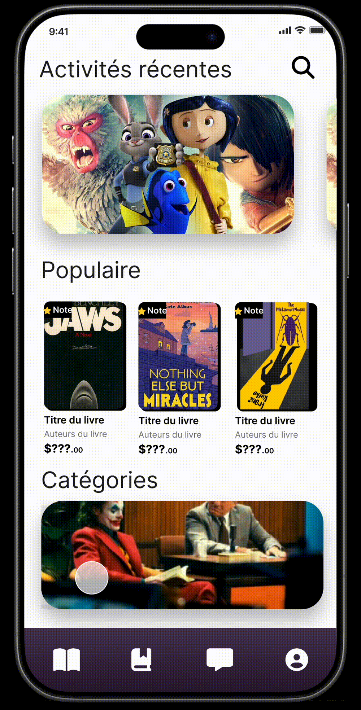
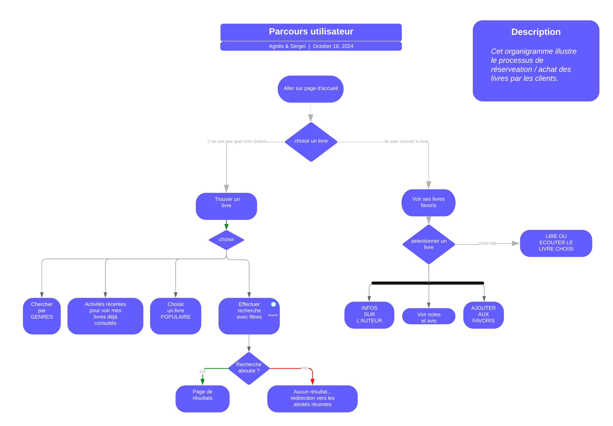

# 📚 BIBLIOMANIAC - Bibliothèque Numérique
*Travail en groupe (2 personnes).
Deadline : 2,5 à 3 jours de réalisation.*

## 📝 Présentation du Projet
Dans le cadre de la refonte de l'application de gestion de livres de *Bibliomaniac*, ce projet vise à concevoir une nouvelle version destinée aux utilisateurs, qu’ils soient passionnés de lecture ou gestionnaires de bibliothèques personnelles ou professionnelles. L'objectif est de recréer et adapter six écrans de l’application à partir du document fourni, en assurant une navigation fluide (prototypage) entre eux via Figma. Deux de ces écrans devront être déclinés pour un usage desktop, en prenant en compte les spécificités de ce support.

## 🎯 Objectifs

- *Recréer et adapter six écrans de l’application* : Assurer une navigation fluide entre les écrans via Figma.
- *Décliner deux écrans pour un usage desktop* : Prendre en compte les spécificités du support desktop.
- *Imaginer le parcours type d'un utilisateur* : Représenter chaque étape depuis la sélection du livre jusqu'à la confirmation de l'emprunt via un diagramme d'activité.
- *Optimiser un écran selon les critères du RGAA* : Améliorer l’accessibilité de l'écran.
- *Utiliser des ressources libres de droits* : Garantir la conformité du projet.

## 🛠️ Modalités d'Évaluation

- *Présentation orale* : Sur les enchaînements des différents écrans de l'application et l'organisation du travail (tâches).
- *Durée de présentation* : 10 minutes.
Organisation des calques & dossiers, nommage des calques.
- *Véridication conformité WCAG* : 
- 🌈 [coolor](https://coolors.co/contrast-checker/f9410a-f6f6f6)
- 🌟 [colorshaker](https://hexcolor.co/color-contrast-checker)

## 📂 Livrables
- 🔗 [Liens vers les maquettes Figma](https://www.figma.com/design/r7drRPTFRfaRMGEegvs7bV/BASE?node-id=4-59&t=6HR08FrROqA23LuT-1)
- 📋 [trello](https://trello.com/b/ael3lOna/biblio)
- 📊 [Diagramme d'activité](https://lucid.app/lucidchart/dd2affd4-d2ec-451d-a2b4-8f7deff36de7/edit?invitationId=inv_abcff057-de0a-4be0-91b3-eaf14deee8c7&page=0eqBfotfVGlV#)

  
  
  
  

## 🤝 Contributeurs ⚙️
👩🏻‍💻Agnès               &               Sergeï🧑🏼‍💻

  
  

